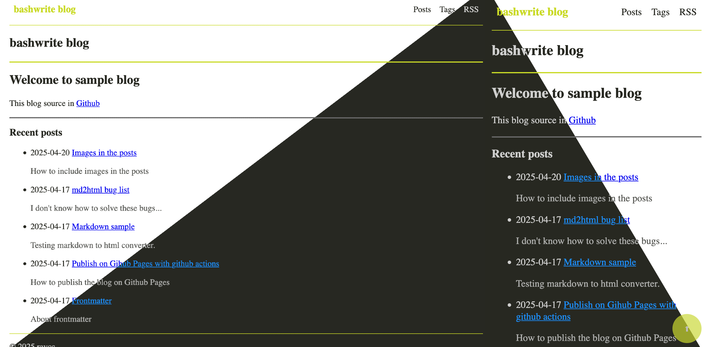

# BashWrite - [demo](https://raycc51.github.io/BashWrite/)



Single, pure bash script for make your blog. 

Inspired by [bashblog](https://github.com/cfenollosa/bashblog)

## Features

- No dependencies
- Support extended Markdown with [mattcone/markdown-guide](https://github.com/mattcone/markdown-guide)
- Darkmode
- Tags page
- Recent posts
- RSS
- Github action for github pages

### Limits

- Hard to customizing
- [Markdown to html converter](https://github.com/RayCC51/md2html) is not perfect - [bug list](https://raycc51.github.io/BashWrite/posts/markdown/md4html-bug.html)

## Quick start

### Install

1. Download `bw.sh` - [Release page](https://github.com/RayCC51/BashWrite/releases).
2. Open `bw.sh`, edit settings and save the file.
3. Open *terminal*, and run `./bw.sh b`
4. Then your blog will be generated in `./`

### Write new posts

1. Write markdown file in *write/*.
2. Markdown file should starts with frontmatter
    ```
    ---
    title: My new post
    description: Write description of this post. 
    date: 2025-02-05
    lastmod: 2025-05-02
    tags: tags seperated by a whitespace
    draft: false
    ---
    ```
3. Save your file and run `./bw.sh b`

## Commands

- `./bw.sh h` : Show help dialog.   
- `./bw.sh b` : Build blog. 

## About directory structure

### Download from repo

- bw.sh
- .github/ - Download this folder if you want to use github pages.

### Automatically generated: Do not edit these files

- checksum/ - Checksum list of markdowns, tags, assets and script.
- posts/
- tags/
- 404.html
- all-posts.html - Contain every posts.
- all-tags.html - Contain every tags.
- index.html
- robots.txt
- rss.xml
- style.css
- sitemap.xml

### Create these folders yourself, and work only within these folders

- write/ - Write your markdowns in this folder. You can also add assets needed for the posting.
- assets/ - Add any assets in this folder. 
