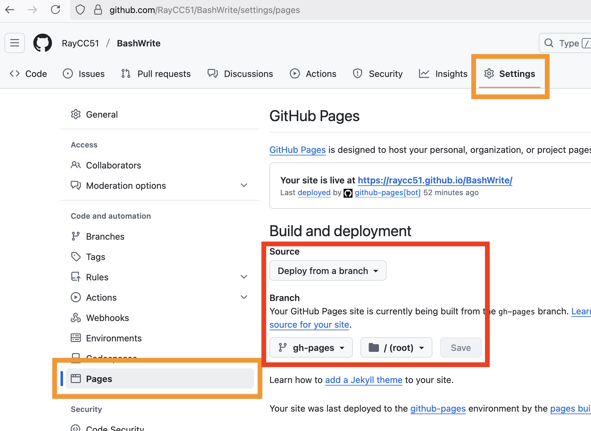

## Download github action

1. Download `.github/workflows/build.yaml`
2. Put the `build.yaml` in your `your-blog-path/.github/workflows/`
3. Make empty file `.nojekyll` in your `your-blog-path/`

### Directory

```
your_blog/
├─ .github/
│  ├─ workflows/
│  │  ├─ build.yaml
├─ write/
│  ├─ post1.md
│  ├─ post2.md
├─ .nojekyll
├─ bw.sh
```

## Settings in github.com



1. Go to the your blog repository
2. Settings -> Code and automation - Pages -> Build and deployment
    - Source: Deploy from a branch
    - Branch: gh-pages /(root)
3. Save the settings

### First time to deploy

todo... make doc
