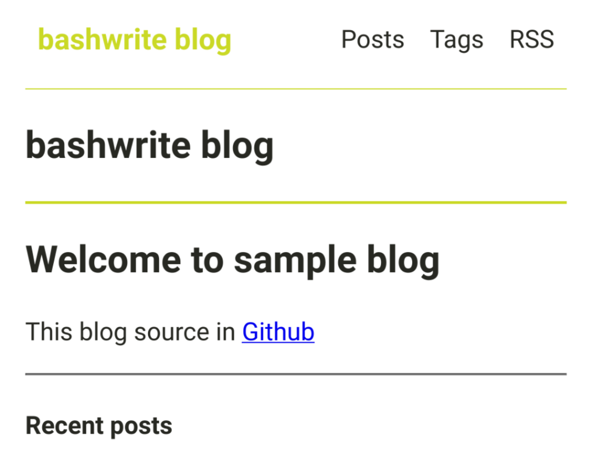

You can use markdown to include the images. 

### 1. Prepare images. 



### 2. Put your images in...

```
your-blog-directory/
├─ write/
│  ├─ new-post/           <<< New!
│  │  ├─ index.md         <<< New!
│  │  ├─ screenshot.png   <<< New!
├─ bw.sh
```

Create a new folder under the `write/` folder. It’s best to name the folder after the title of the new post you will write.

Try to keep only 1 markdown file per folder if possible. This will make file management easier.

Name the markdown file `index.md`. This way, you can have a clean URL.

Also, include any images you want to put in this folder.

### 3. Write markdown.


```md

```
